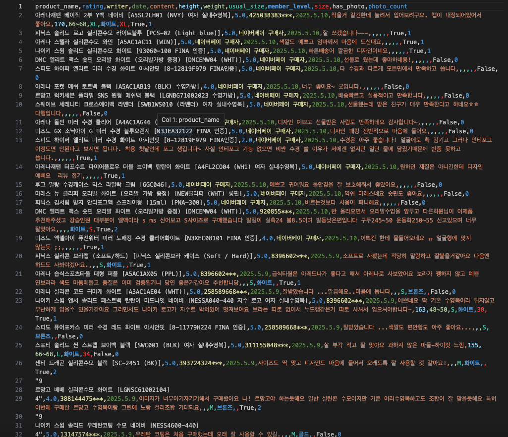
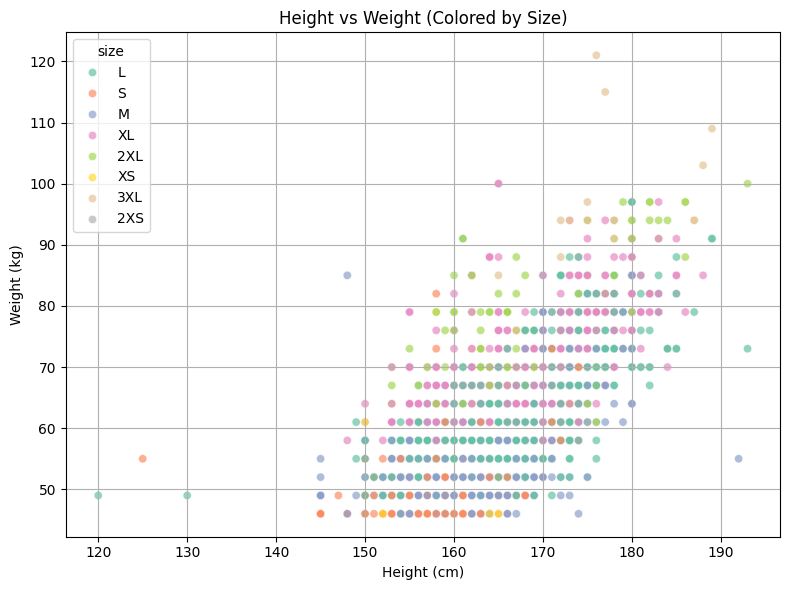
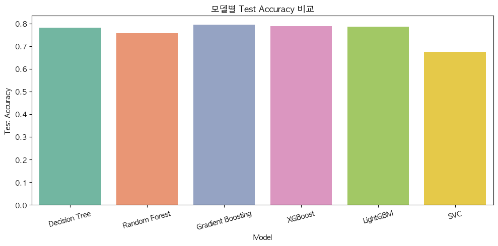
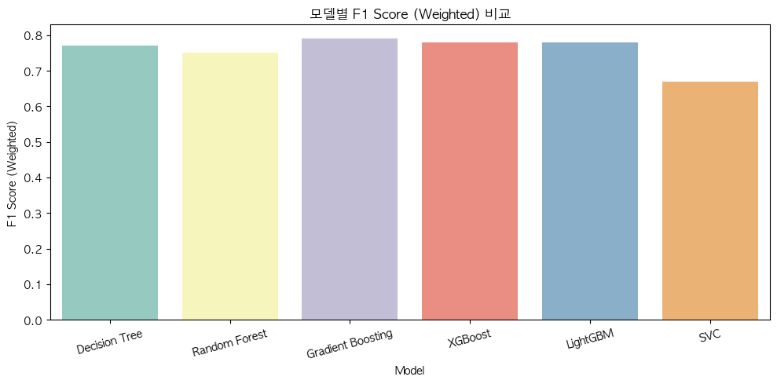

_수집한 수영복 리뷰 데이터 (키, 몸무게, 사이즈, 리뷰 텍스트 포함)_

---

# 🩱 SwimFitPredictor


**수영복 사이즈 추천 모델 & EDA 프로젝트**  
  
가나스윔 사이트의 리뷰를 크롤링하여 키, 몸무게, 평소 착용 사이즈, 구매 사이즈 등 정보를 수집하여  
사용자의 니즈에 맞는 수영복 사이즈를 추천하는 모델을 구축하였습니다.


---

## 프로젝트 개요

- **목적**: 사용자 체형(키, 몸무게, 성별, 평소 사이즈)과 브랜드 정보를 기반으로 적절한 수영복 구매 사이즈 예측
- **주요 작업**:
  - Selenium을 활용한 iframe 기반 리뷰 크롤링
  - 데이터 전처리 및 EDA
  - SMOTE로 데이터 불균형 처리
  - 다양한 분류 모델 학습 (DT, RF, GBM, XGBoost, LGBM, SVC)
  - GridSearchCV로 하이퍼파라미터 최적화


---

## 기술 스택
- Python
- Selenium
- pandas, tqdm
- imageio, scikit-image
- BeautifulSoup4
- Scikit-learn (GridSearchCV, train_test_split, accuracy_score, classification_report)
- imbalanced-learn (SMOTE)
- LightGBM
- Jupyter Notebook

---

## 디렉토리 구조
``` 
swim_fit_predictor/
├── notebook/
│ ├── review_crawling.ipynb # 리뷰 데이터 크롤링
│ ├── grid_search_log.txt # GridSearchCV 튜닝 로그
│ ├── modeling.ipynb # LightGBM 학습 및 평가
│ ├── review_eda.ipynb # 리뷰 데이터 EDA (1)
│ └── review_eda2.ipynb # 리뷰 데이터 EDA (2)
├── data/ 
│ └── [데이터셋 파일들, 예: swim_reviews_0510.csv]
├── imgs/
├── docs/ 
├── .gitignore
├── requirements.txt
└── README.md
``` 

---

## 데이터 분포 시각화



위 그래프는 키(cm)와 몸무게(kg) 분포를 사이즈별로 색상 구분한 scatter plot입니다.  
데이터셋이 어떤 패턴과 밀집도를 가지는지, 사이즈별 체형 차이가 어떻게 나타나는지를 직관적으로 확인할 수 있습니다.

---

## 하이라이트 코드

```python
# 데이터 불균형 처리
from imblearn.over_sampling import SMOTE
sm = SMOTE(random_state=42)
X_resampled, y_resampled = sm.fit_resample(X, y)

# LightGBM 모델 학습 + GridSearchCV
from sklearn.model_selection import GridSearchCV
param_grid = {
    'num_leaves': [31, 50],
    'max_depth': [-1, 10],
    'learning_rate': [0.05, 0.1],
    'n_estimators': [100, 300],
    'min_child_samples': [20, 50],
    'subsample': [0.8, 1.0],
    'colsample_bytree': [0.8, 1.0]
}
grid_search = GridSearchCV(LGBMClassifier(random_state=42), param_grid, scoring='accuracy', cv=3, n_jobs=-1, verbose=1)
grid_search.fit(X_train, y_train)
```

---

## 프로젝트 실험 및 결과

---

### 1. 전처리 및 모델링 실험

- 전처리 및 모델링 개요:
  - MinMaxScaler를 활용한 수치 정규화
  - 클래스 불균형 해결을 위한 SMOTE 적용
  - GridSearchCV, RandomizedSearchCV를 통한 하이퍼파라미터 튜닝
  - 성능 비교 및 시각화를 통한 최종 모델 선정

- 비교한 분류 모델:
  - Logistic Regression
  - Decision Tree
  - Random Forest
  - Gradient Boosting Classifier
  - XGBoost
  - LightGBM
  - SVC

---

### 2. 데이터 불균형 처리 (SMOTE)

| Size  | Before SMOTE | After SMOTE |
|-------|--------------|-------------|
| XS    | 278          | 17,317      |
| S     | 4,774        | 17,317      |
| M     | 15,556       | 17,317      |
| L     | 17,317       | 17,317      |
| XL    | 8,765        | 17,317      |
| 2XL   | 1,690        | 17,317      |
| 3XL   | 212          | 17,317      |

- Accuracy (Before SMOTE): 0.68
- Accuracy (After SMOTE): 0.78

---

### 3. 하이퍼파라미터 튜닝 (GridSearchCV)

#### 탐색한 파라미터:
```python
param_grid = {
    'num_leaves': [31, 50],
    'max_depth': [-1, 10],
    'learning_rate': [0.05, 0.1],
    'n_estimators': [100, 300],
    'min_child_samples': [20, 50],
    'subsample': [0.8, 1.0],
    'colsample_bytree': [0.8, 1.0]
}
```

#### 주요 모델별 하이퍼파라미터 요약
| 모델 | 주요 하이퍼파라미터 |
|------|----------------------|
| Decision Tree | max_depth=7 |
| Random Forest | n_estimators=100, max_depth=10 |
| Gradient Boosting | n_estimators=100, learning_rate=0.1, max_depth=6 |
| XGBoost | n_estimators=100, learning_rate=0.1, max_depth=6, subsample=0.8, colsample_bytree=0.8 |
| LightGBM | n_estimators=100, learning_rate=0.1, max_depth=9 |
| SVC | kernel='linear', C=1.0, probability=True |

최종 성능:
- Best Test Accuracy: 0.79

---

## 성능 평가

- 최적 파라미터:
  - num_leaves=50, max_depth=-1, learning_rate=0.05, n_estimators=300, min_child_samples=20, subsample=0.8, colsample_bytree=0.8
- 최종 정확도:
  - Train Accuracy: 약 81%
  - Test Accuracy: 약 79%

#### 모델 성능 비교 테이블
| Model                 | Train Accuracy | Test Accuracy | F1 Score (Weighted) |
|------------------|----------------|----------------|---------------------|
| Decision Tree         | 0.8147         | 0.7814         | 0.77                |
| Random Forest         | 0.7644         | 0.7562         | 0.75                |
| **Gradient Boosting**  ⭐️ | **0.8099**         | **0.7940**         | **0.79**                |
| XGBoost               | 0.8179         | 0.7876         | 0.78                |
| LightGBM              | 0.8007         | 0.7860         | 0.78                |
| SVC                   | 0.6837         | 0.6748         | 0.67                |

#### 모델별 Test Accuracy 비교


#### 모델별 F1-Score(Weighted) 비교


---

## 최종 모델 선정
- <mark>Gradient Boosting</mark> 모델이 테스트 데이터에서 가장 높은 정확도(0.7940)와 F1 Score(0.79)를 기록함
- 전체 모델 중 가장 우수한 Test Accuracy와 F1 Score를 보였으며, 과적합 없이 안정적인 성능을 나타냄
- 따라서 본 프로젝트에서는 Gradient Boosting을 최종 추천 모델로 선정함

---

## 참고 사항
- 본 프로젝트는 **학습 및 포트폴리오 목적**으로 진행되었으며, 크롤링 대상 사이트의 로봇 배제 정책 및 약관을 존중합니다.

